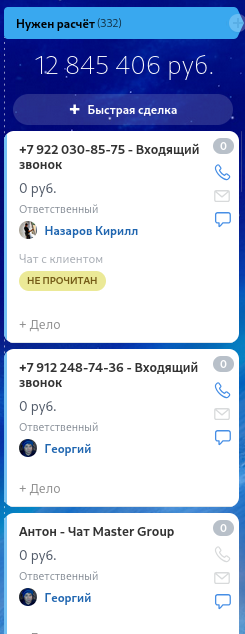
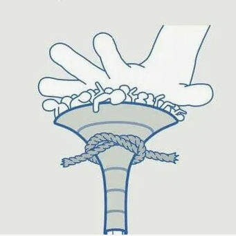

# CRM-диагностика: Оконный бизнес
### Как системный подход увеличит выручку 🤏🏻 на 5-6 млн рублей за полгода.

Бизнес-аналитик / Интегратор CRM
*Февраль 2025*

<!-- NOTE: Начните с паузы. Установите зрительный контакт. "Добрый день! Сегодня мы поговорим не просто о CRM, а о том, как системный подход к автоматизации может принести нам дополнительные 5-6 миллионов рублей выручки за полгода. Мы провели глубокий анализ  процессов и выделили ключевые точки роста." -->

---

| Причина провала               | количество   |сумма|
|-------------------------------|--------------|-|
|Заказали в другом месте|3105|92 292 640 руб.|
|Уже не нужно (сделка просрочена)|124|2 655 303 руб.|
|Не можем выполнить|106|2 033 361 руб.|
|Не ответили |722|21 863 670 руб.|
|Долго|138|314 250 руб.|
|Дорого|40|1 450 655 руб.|
|Пока еще не нужно|53|3 745 818 руб.|

---
## Финансовые потери — считаем упущенное

### Прямые потери:
- **160 000 руб./год** — "остывшие" лиды
- **15% конверсии** при потенциале 30-40%
- **30 минут на поиск** 1 рабочего лида
<!-- NOTE: "Давайте начнём с цифр. Каждый год мы теряем минимум 160 тысяч рублей только на тех лидах, которые 'остывают' без должной обработки. Наша конверсия 15% при том, что норма для рынка — 30-40%. -->
---
## Финансовые потери — считаем упущенное

### Косвенные потери:
- Время менеджеров на рутину
- Ошибки в расчётах и договорах
- Потеря репутации из-за срывов

<!-- NOTE: Менеджеры тратят по 30 минут только на поиск одного рабочего лида в общей массе. Это не считаем косвенные потери — время, ошибки, репутацию." -->
---

## **Воронка забита шлаком**

### ⚠️Проблемы:
1. Нет обработки входящих звонков
2. Архитектура не ясна — путаница воронок
3. Дублирование лидов
4. Важные заявки тонут
> **"Чтобы найти 5 рабочих лидов, нужно перебрать 30 нерелевантных"**

<!-- NOTE: "Вот реальная проблема: менеджер тратит время не на продажи, а на сортировку. Коттеджные проекты теряются среди мелких заказов. Входящие звонки не обрабатываются автоматически — нет расшифровки, нет квалификации. Мы не понимаем, куда дальше двигать клиента. И самая большая проблема — архитектура. У нас две воронки: лиды и сделки, но нет чётких правил перехода между ними." -->

---

## **Ресурсы тратятся неэффективно**

### Нет системы расстановки приоритета:
- Время на малоперспективные расчеты;
- Расчеты "одного окна" с низкой рентабельностью;
- Реактивная работа вместо стратегической.
<!-- NOTE: "Менеджеры тратят часы на расчёт КП по сделкам с низкой вероятностью выигрыша. Считают одно окно, когда могли бы заниматься комплексными заказами. Почему? Потому что нет системы приоритетов.  -->
---

### Нет критериев оценки:
- Не определяем стадию клиента;
- Не оцениваем соответствие профилю;
- Работаем со всеми подряд.
<!-- NOTE: Мы не оцениваем: на какой стадии клиент — он только собирает информацию или уже готов к покупке? Соответствует ли его потребность нашему профилю? Мы реагируем на всё подряд, а не фокусируемся на целевых клиентах." -->

---

## **Ключевой процесс — расчёт КП — узкое место**

### ⚠️Организационные проблемы:
- Сложные расчёты не согласуются с инженером
- Нет регламента "20 минут"на простой расчёт
- Есть прайс, но он не заведён в товары

<!-- NOTE: "Сердце нашего бизнеса — расчёт КП. Сейчас это больное место. В Битриксе нет удобного конструктора окон. Нужно вставлять эскизы вручную. Менеджер тратит час на то, что должно занимать 10 минут. Сложные расчёты для лоджий и балконов 'блуждают' — непонятно, куда их направить. Нет регламента: '20 минут на первичный расчёт'.-->
---

## **Работа после замера не отражена в CRM**

### Симптомы:
- Лиды "остывают" без работы
- Нет работы с возражениями после замера
- Нет чёткой границы ответственности между офисом и замерщиком
<!-- NOTE: Обычно мы говорим что на этой стадии ответственность за сделку переходит к замерщику. Он даёт задание в офис, чтобы сделали КП, берёт общение с клиентом на себя, контролирует выполнение договорённостей, но далее мы видим что колонка постоянно заполненна и не знаем какая работа ведётся -->

---

## **Дисциплина продаж отсутствует**

### Критическая проблема:
> **"НЕТ системных прозвонов после КП и после замера"**

### Симптомы:
- Нет планирования дня менеджера
- 30% сообщений непрочитаны
<!-- NOTE: "Вот главная причина низкой конверсии. Мы отправляем КП и... ждём. Замер сделали и... ждём. Нет системы обязательных прозвонов. Клиент остывает, уходит к конкурентам. При этом у менеджеров нет плана на день: когда расчёты, когда звонки.-->
---
## **Дисциплина продаж отсутствует**

### ⚠️Потери:
- Падение конверсии на 40-50%
- Невозможность оценить эффективность

<!-- NOTE: Результат: мы не понимаем, почему сделка сорвалась и как работать с возражениями." -->

---

## Нет работы с входящими звонками

### ⚠️Проблемы:

- нет автоматической рассылкой визитки
- не ставятся задачи по расчёту после звонка
- нет системы обработки рекламаций
- нет перенаправления звонков в зависимости от стадии

<!-- NOTE: "Еще одна причина низкой конверсии. Мы платим за рекламу, наши телефоны висят на сайте, входящий звонок это потенциальный лид. Он так же должен быть квалифицирован как целевой или нет." -->

---

## **План решения — 3 ключевых направления**

### 1. **Чистка и автоматизация воронки**
Робот для звонков, правила перехода на стадии продажи, чёткая квалификация заказчиков

### 2. **Дисциплина процессов**
Регламент дня менеджера, обязательные прозвоны, система приоритетов

### 3. **Техническая интеграция**
Товары и вариации конструктор КП, Разные шаблоны с разными эскизами для КП, Bitrix24 ↔ 1С, единая карточка

<!-- NOTE: "Итак, что делаем? Три ключевых направления. Первое: наводим порядок в воронке. Автоматизируем первичную обработку. Второе: внедряем дисциплину. Менеджер должен знать, что делать в каждый момент времени. Третье: техническая часть — удобный конструктор КП, интеграция с 1С, единое информационное пространство для всех отделов." -->

---

## **Ожидаемые результаты и ROI**

### Через 3 месяца:
- ↑ Конверсия до **25-30%** (с 15%)
- ↓ Время на КП до **10-15 минут** (с 60)
- ↑ Лидов на 40%
- ↓ Ошибок на 90%

### Финансовый эффект:
- Сохранение: **160 000 руб./год**
- Доп. выручка: **5-6 млн руб./полгода**
- Экономия времени: **200+ часов/мес**

<!-- NOTE: "Что это даст? Через три месяца конверсия вырастет с 15% до 25-30%. Время на расчёт КП сократится с часа до 10-15 минут. Количество обрабатываемых лидов увеличится на 40%. Ошибок в документах станет на 90% меньше. Финансовый эффект: сохраним 80 тысяч рублей в год на потерянных лидах, плюс дополнительная выручка 5-6 миллионов за полгода. Плюс экономия 200+ часов времени менеджеров ежемесячно." -->

---

## **Следующие шаги**

### Для запуска проекта:
1. **Аудит процессов** (3-5 дней) — необходимо выявить все узкие места
2. **Приоритизация задач** — определить что делать в первую очередь
3. **Согласование бюджета** — определить уровень инвестиций в автоматизацию
4. **Назначение ответственного** — кто будет курировать проект и принимать ключевые решения?

<!-- NOTE: Первый шаг — аудит - нужно пройти все процессы от звонка до монтажа. Затем расставить приоритеты: что даст максимальный эффект при минимальных затратах. Нужно согласовать бюджет: какие инвестиции быстрее окупятся за счёт роста выручки. Кого мы назначим ответственным и как мы увидим результаты работы? -->

---

## **Вопросы для обсуждения**

1. Какие проблемы наиболее критичны для нас прямо сейчас: что больше всего мешает работе и снижает выручку?

2. Какой бюджет на решение этих задач? Какие инвестиции мы готовы рассмотреть для оптимизации процессов?
<!-- NOTE: "Давайте обсудим. Какие из озвученных проблем мы считаеем наиболее критичными? Что больше всего мешает работе прямо сейчас? Какой бюджет на решение готовы рассмотреть — это инвестиции в рост. -->

---
## **Вопросы для обсуждения**

3. **Кто будет ответственным за проект? Кто будет принимать решения и контролировать ход реализации проекта?

4. Какие сроки реализации комфортны? Когда мы хотим увидеть первые значимые результаты от внедрения изменений?

<!-- NOTE: Кто будет ответственным с нашей стороны — кто будет принимать решения и контролировать процесс? И какие сроки реализации для вас комфортны? Может быть, есть что-то ещё, что мы не затронули?" -->

---

# **Спасибо за внимание!**

### **Готовы сделать следующий шаг?**

**Контакты для связи:**
*Бизнес-аналитик + Интегратор CRM*

📞 Телефон: 8 343 247-22-02
🖥️ Сайт: https://kiselevgroup.com/
📧 Email: info@kiselevgroup.com

<!-- NOTE: Мы пообщались с разными интеграторами и бизнес аналитиками, у Киселёва привлекло прозрачное ценообразование и комплексный подход с дальнейшей поддержкой. Во время презентации они показали доску в Миро, где будет описан наш проект оцифровки бизнеса в b24. Первый шаг — аудит, который покажет точную картину и конкретный план.--> 

---

### **Диагностика CRM*

- 📉 Финансовые потери
- 🗑️  Воронка "забита шлаком"
- 🎯 Приоритизация задач
- ⏱️  Проблема с КП
- 📞 Коммуникации разорваны
- 📑 Документооборот
- ⚠️ Проблема
- ✅ Решение
- 📈 Результаты
- 🗺️  Дорожная карта
- ❓ Вопросы

<!-- NOTE: Общая цена работы около 120 тысяч рублей из них аудит - 60 т.р.Сейчас они предлагают договориться о проведении аудита. Готовы ли мы сделать следующий шаг?" -->
