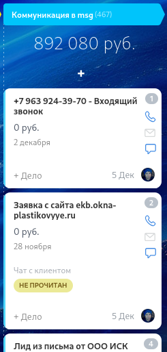

# CRM-диагностика: Оконный бизнес
### Как системный подход увеличит выручку 🤏🏻 на 5-6 млн рублей за полгода.

Бизнес-аналитик / Интегратор CRM
*Февраль 2025*

<!-- NOTE: Начните с паузы. Установите зрительный контакт. "Добрый день! Сегодня мы поговорим не просто о CRM, а о том, как системный подход к автоматизации может принести нам дополнительные 5-6 миллионов рублей выручки за полгода. Мы провели глубокий анализ  процессов и выделили ключевые точки роста." -->

---

## Финансовые потери — считаем упущенное за год

| Причина провала               | количество   |сумма|
|-------------------------------|--------------|-|
|Заказали в другом месте|3105|92 292 640 руб.|
|Уже не нужно (сделка просрочена)|124|2 655 303 руб.|
|Не можем выполнить|106|2 033 361 руб.|
|Не ответили |722|21 863 670 руб.|
|Долго|138|314 250 руб.|
|Дорого|40|1 450 655 руб.|
|Пока еще не нужно|53|3 745 818 руб.|

<!-- NOTE: "Давайте начнём с цифр. Каждый год мы теряем минимум ? тысяч рублей только на тех лидах, которые 'остывают' без должной обработки. Наша конверсия 15% при том, что норма для рынка — 30-40%. Менеджеры тратят по 30 минут только на поиск одного рабочего лида в общей массе. Это не считаем косвенные потери — время, ошибки, репутацию." -->

---

### Прямые потери:
- **80 000 руб./год** — "остывшие" лиды
- **15% конверсии** при потенциале 30-40%
- **30 минут на поиск** 1 рабочего лида

### Косвенные потери:
- Время менеджеров на рутину
- Ошибки в расчётах и договорах
- Потеря репутации из-за срывов
---

## **Воронка забита шлаком**

### ⚠️Проблемы:
1. Дублирование лидов
2. Важные заявки тонут
3. Нет обработки входящих звонков
4. Архитектура не ясна — путаница воронок

> **"Чтобы найти 5 рабочих лидов, нужно перебрать 30 нерелевантных"**

<!-- NOTE: "Вот реальная проблема: менеджер тратит время не на продажи, а на сортировку. Коттеджные проекты теряются среди мелких заказов. Входящие звонки не обрабатываются автоматически — нет расшифровки, нет квалификации. Мы не понимаем, куда дальше двигать клиента. И самая большая проблема — архитектура. У нас две воронки: лиды и сделки, но нет чётких правил перехода между ними." -->

---

## **Ресурсы тратятся неэффективно**

### Нет системы расстановки приоритета:
- Время на малоперспективные расчеты;
- Расчеты "одного окна" с низкой рентабельностью;
- Реактивная работа вместо стратегической.

---

### Нет критериев оценки:
- Не определяем стадию клиента;
- Не оцениваем соответствие профилю;
- Работаем со всеми подряд.

<!-- NOTE: "Менеджеры тратят дни на расчёт тендеров с низкой вероятностью выигрыша. Считают одно окно, когда могли бы заниматься комплексными заказами. Почему? Потому что нет системы приоритетов. Мы не оцениваем: на какой стадии клиент — он только собирает информацию или уже готов к покупке? Соответствует ли его потребность нашему профилю? Мы реагируем на всё подряд, а не фокусируемся на целевых клиентах." -->

---

## **Ключевой процесс — расчёт КП — узкое место**

### ⚠️Организационные проблемы:
- Сложные расчёты не согласуются с инженером
- Нет регламента "20 минут"на простой расчёт
- Работа после замера не отражена в CRM

<!-- NOTE: "Сердце нашего бизнеса — расчёт КП. Сейчас это больное место. В Битриксе нет удобного конструктора окон. Нужно вставлять эскизы вручную. Менеджер тратит час на то, что должно занимать 10 минут. Сложные расчёты для лоджий и балконов 'блуждают' — непонятно, куда их направить. Нет регламента: '20 минут на первичный расчёт'. Отсюда ошибки и задержки." -->
---
## **Работа после замера не отражена в CRM**

### Симптомы:
- Лиды "остывают" без работы
- Нет работы с возражениями после замера
- Нет чёткой границы ответственности между офисом и замерщиком

---
## **Дисциплина продаж отсутствует**

### Критическая проблема:
> **"НЕТ системных прозвонов после КП и после замера"**

### Симптомы:
- Нет планирования дня менеджера
- 30% сообщений непрочитаны

### ⚠️Потери:
- Падение конверсии на 40-50%
- Невозможность оценить эффективность

<!-- NOTE: "Вот главная причина низкой конверсии. Мы отправляем КП и... ждём. Замер сделали и... ждём. Нет системы обязательных прозвонов. Клиент остывает, уходит к конкурентам. При этом у менеджеров нет плана на день: когда расчёты, когда звонки. 30% сообщений от клиентов остаются непрочитанными в WhatsApp. Результат: мы не понимаем, почему сделка сорвалась и как работать с возражениями." -->

---
## Нет работы с входящими звонками

### ⚠️Проблемы:

- нет автоматической рассылкой визитки
- не ставятся задачи по расчёту после звонка
- нет системы обработки рекламаций
- нет перенаправления звонков в зависимости от стадии

---
## **План решения — 3 ключевых направления**

### 1. **Чистка и автоматизация воронки**
Настройка правил, робот для звонков, чёткая архитектура

### 2. **Дисциплина процессов**
Регламент дня, обязательные прозвоны, система приоритетов

### 3. **Техническая интеграция**
Конструктор КП, Bitrix24 ↔ 1С, единая карточка

<!-- NOTE: "Итак, что делаем? Три ключевых направления. Первое: наводим порядок в воронке. Автоматизируем первичную обработку. Второе: внедряем дисциплину. Менеджер должен знать, что делать в каждый момент времени. Третье: техническая часть — удобный конструктор КП, интеграция с 1С, единое информационное пространство для всех отделов." -->

---

## **Ожидаемые результаты и ROI**

### Через 3 месяца:
- ↑ Конверсия до **25-30%** (с 15%)
- ↓ Время на КП до **10-15 минут** (с 60)
- ↑ Лидов на 40%
- ↓ Ошибок на 90%

### Финансовый эффект:
- Сохранение: **80 000 руб./год**
- Доп. выручка: **5-6 млн руб./полгода**
- Экономия времени: **200+ часов/мес**

<!-- NOTE: "Что это даст? Через три месяца конверсия вырастет с 15% до 25-30%. Время на расчёт КП сократится с часа до 10-15 минут. Количество обрабатываемых лидов увеличится на 40%. Ошибок в документах станет на 90% меньше. Финансовый эффект: сохраним 80 тысяч рублей в год на потерянных лидах, плюс дополнительная выручка 5-6 миллионов за полгода. Плюс экономия 200+ часов времени менеджеров ежемесячно." -->

---

## **Следующие шаги**

### Для запуска проекта:
1. **Аудит процессов** (3-5 дней) — выявим все узкие места
2. **Приоритизация задач** — что делать в первую очередь
3. **Согласование бюджета** — инвестиции в автоматизацию
4. **Назначение ответственного** — кто будет курировать с вашей стороны
5. **Старт пилота** (2 недели) — первые настройки и обучение

<!-- NOTE: "Как начинаем? Первый шаг — глубокий аудит на 3-5 дней. Мы с вами пройдём все процессы от звонка до монтажа. Затем расставим приоритеты: что даст максимальный эффект при минимальных затратах. Согласуем бюджет — это инвестиции, которые окупятся за счёт роста выручки. Назначим ответственного с вашей стороны. И запустим пилотный проект на 2 недели, чтобы вы сразу увидели первые результаты." -->

---

## **Вопросы для обсуждения**

1. Какие проблемы наиболее критичны для вас прямо сейчас?
   - Что больше всего мешает работе?

2. **Какой бюджет на решение этих задач?**
   - Какие инвестиции готовы рассмотреть?

---
## **Вопросы для обсуждения**

3. **Кто будет ответственным за проект?**
   - Кто будет принимать решения и контролировать?

4. **Какие сроки реализации комфортны?**
   - Когда хотите увидеть первые результаты?

<!-- NOTE: "Давайте обсудим. Какие из озвученных проблем вы считаете наиболее критичными? Что больше всего мешает работе прямо сейчас? Какой бюджет на решение готовы рассмотреть — это инвестиции в рост. Кто будет ответственным с вашей стороны — тот, кто будет принимать решения и контролировать процесс? И какие сроки реализации для вас комфортны? Может быть, есть что-то ещё, что мы не затронули?" -->

---

# 🤝🏻**Спасибо за внимание!**

🤝🏻
### **Готовы сделать следующий шаг?**

**Контакты для связи:**
*Бизнес-аналитик / Интегратор CRM*
📞 Телефон: +7 (922) 220 70 74
📧 Email: kirilnazarov@gmail.com

<!-- NOTE: "Спасибо за внимание! Мы готовы начать работу. Первый шаг — аудит, который покажет точную картину и конкретный план. Давайте договоримся о следующей встрече, где обсудим детали. Готовы сделать следующий шаг?" -->

---

### **Диагностика CRM** 📊

**Проблемы:** ⚠️
**Решение:** ✅
**Результаты:** 📈

---
- 📉 Финансовые потери
- 🗑️  Воронка "забита шлаком"
- 🎯 Приоритизация задач
- ⏱️  Проблема с КП
- 📞 Коммуникации разорваны
- 📑 Документооборот
- ✅ Решение
- 📈 Результаты
- 🗺️  Дорожная карта
- ❓ Вопросы
