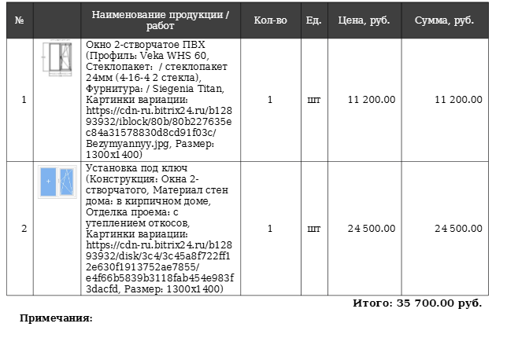

# Внедрение товарного каталога с вариациями в Битрикс24
### Почему это нужно делать в рабочее время (или как проект)

<!-- NOTE: Начните с паузы. Установите зрительный контакт. "Добрый день! Сегодня мы рассмотрим как сколько времени занимает расчёт и как формируется коммерческое предложение -->

---

## Проблема: текущие потери
- Выявление потребности **8–14** минут;
- **10–15 минут** на один расчёт КП (ручной подбор из прайса);
- Менеджеры **ленятся** делать сложные расчёты (внутренняя отделка балкона) → потеря лидов;
- **Неиспользуемый потенциал** Битрикс24: есть прайс, но он не заведён в товары и склад;
- Тратим время в случае изменения потребности, хотя в битрикс24 есть инструмент - **предложения**;
- Когда нужно вручную менять КП которое сделал другой менеджер не понятна логика расчёта; 
- Трудно ответить: "считал лоджию не я, сейчас уточню у сотрудника как формируется цена;
- Клиенты всё чаще недовольны подходом "цена от", им нужна конкретика, обоснование пусть и большей цены, гарантия что цена не вырастет в разы в процессе работы;
- **Ошибки** в КП → снижение доверия клиентов.

<!-- NOTE: C точки зрения рядового сотрудника отдела продаж есть действия, которые отнимают много времени и в которых мы часто допускаем ошибки: расчёт КП, оформление и подписание договора. Расчёт в дилерской программе нужен при заказе, а когда заказчик интересуется ценой — нужно сообщить цену и понимание из чего она складывается, предоставить возможность выбора, показать опции от которых можно отказаться  -->

---

## Решение: товарный каталог + вариации
- Единая база: оконные конструкции отличаются комплектации (профиль, стеклопакет, фурнитура), заводу производителю?;
- Услуги монтажа с **автоматическим расчётом цены** в зависимости от опций (парапет; боковая створка, высота, вынос, обшивка фасада, утепление откосов);
- Услуги по отделке в нескольких карточках с выбором материала и размера, в опциях - утепление, подъём пола;
- Готовый шаблон КП за **2–3 минуты**, при расчёте по телефону - задаем правильные вопросы, появляется конкретика;
- Дополнительные продажи: продаём не отдельные товары а опции;
- Или попадаем в потребность или понимаем - не наш клиент.
<!-- NOTE: "Сердце нашего бизнеса — расчёт КП. Сейчас это больное место. Но уже найдено решение, эскизы не нужно вставлять эскизы вручную.-->

---
## Что уже/будет сделано (16 часов работы)

| Этап                                                        | Часы   |
| ----------------------------------------------------------- | ------ |
| 1. Анализ и проектирование структуры                        | 2      |
| 2. Визуализация будущих карточек на доске, согласование     | 2      |
| 3. Настройка матрицы "Свойства торговых предложений"        | 2      |
| 4. Создание каталога (разделы, товары, услуги, изображения) | 5      |
| 5. Настройка CRM (шаблоны КП)                               | 2      |
| 6. Обучение менеджеров + документация                       | 3      |
| **Итого**                                                   | **16** |

---

## Стоимость и экономия

| Вариант | Затраты |
|---------|--------|
| Внешний интегратор (16 ч × 5000₽) | **80 000 ₽** |
| Моя работа (16 ч × 2500₽) | **40 000 ₽** |
| **Экономия для компании** | **40 000 ₽** |

*Плюс*: исключаем риски передачи данных стороннему подрядчику.

---

## Варианты реализации

1. **Оплата как проект**  
   – 60 000 ₽ (16 часов)  
   – Выполняется в удобное время (в т.ч. вне рабочего)

2. **Выделение рабочего времени**  
   – Освободить меня от текущих задач на **16 часов** (3–4 дня)  
   – Без доплат, работа идёт в счёт оклада  
   – Экономия по сравнению с наёмным интегратором: ~ **40 000 ₽**

---

## Почему не в нерабочее время?

- Я уже выполняю **8‑часовую норму** 
- Исключаем переработки и выгорание  
- Это **проект**, приносящий долгосрочную экономию компании  
- Бесплатное выполнение создаёт **опасный прецедент** для будущих улучшений

---

## Предложение

- **Выделите 16 часов рабочего времени** на внедрение  
- Или **оплатите как проект** (60 000 ₽)  
- В качестве пилота: **4 часа** на создание прототипа (3–5 товаров) → оценить эффект

---

## Результат после внедрения
- Время на КП: **10–15 мин → 2–3 мин**  
- Количество обработанных заявок: **↑ на 100%**  
- Ошибки в расчётах: **↓ на 90%**  
- Освобождённое время менеджеров → **рост продаж**

---
## Приложение №1: изображения в будущем КП

---
## Решение за вами

**Вариант А:** инвестировать 16 часов моего рабочего времени сейчас → получить постоянную экономию времени и денег.

**Вариант Б:** продолжать терять 40 000 ₽/день на ручных расчётах.

*Жду вашего решения.*